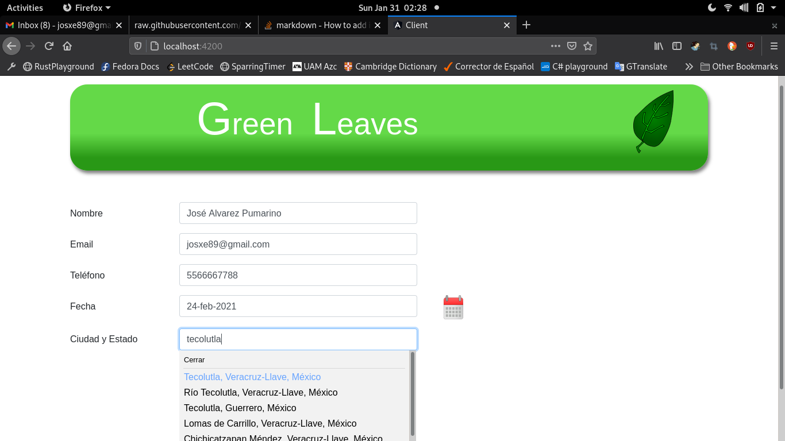
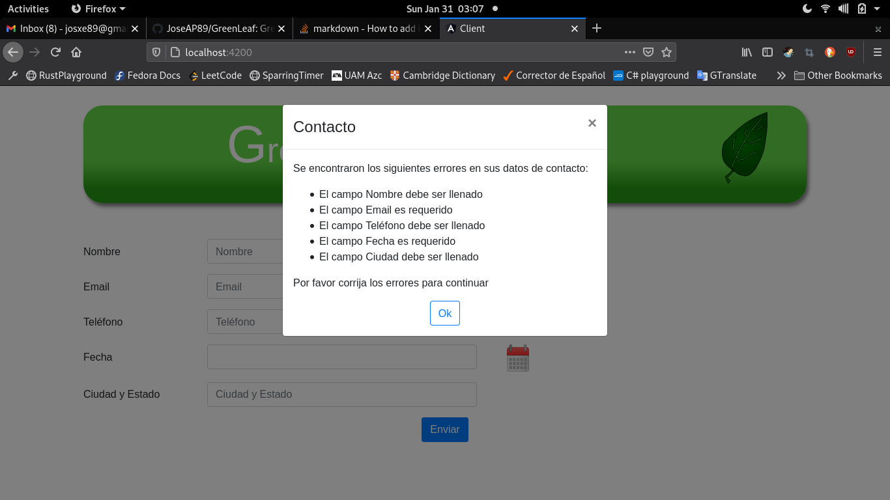
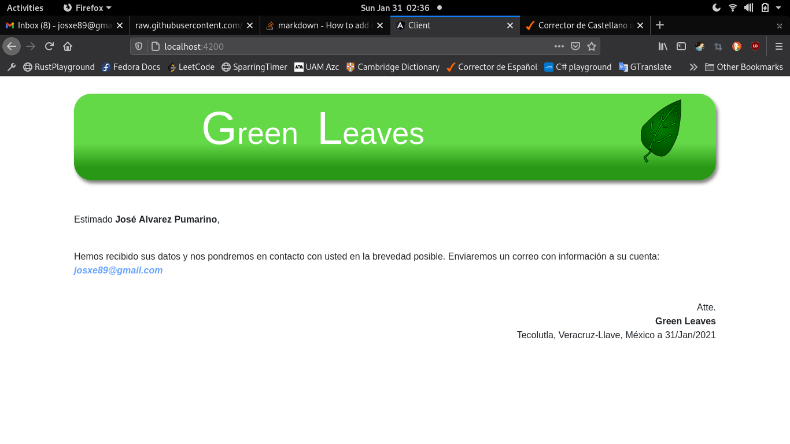

# Green Leaf

### Figura 1. Presentación de la página principal

La imagen muestra como al escribir aparece una lista de las ciudades del mundo que cumplen con la búsqueda.

### Figura 2. Formato con datos de la solicitud incorrectos

Aquí nos aparece un modal donde indica al usuario cuáles campos son incorrectos en la forma llenada, en la imagen no se colocan
todas las posibles combinaciones de errores que pueden aparecer para las distintas validaciones. Solo es calidad de ejemplo.

### Figura 3. Presentación de la página de éxito

Figura 3 nos aparece una vez que los campos de la forma han sido llenados correctamente y se han mandado al servidor sin ningún problema.

